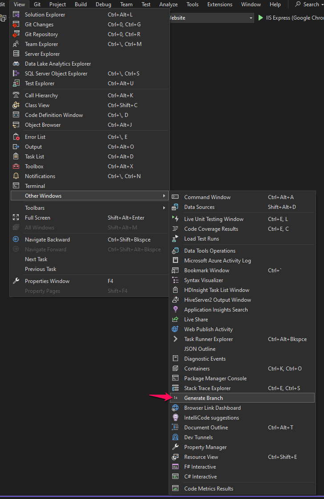

# BranchNameGenerator
BranchNameGenerator is a Visaul Studio Extension.

# How is it used?
First, you need to install the [BranchNameGenerator](https://marketplace.visualstudio.com/items?itemName=BranchNameGenerator.SGBranchNameGenerator).

You find the "Generate Branch" after the installation;

You copy any task title or any text then paste it to the following textbox. Then click the "Generate" button after then you should click the "Copy" button to copy.

Example Input: "Lorem Ipsum is simply dummy text of the printing and typesetting industry."

#### Underline Sperator

#### Hyphen Sperator
